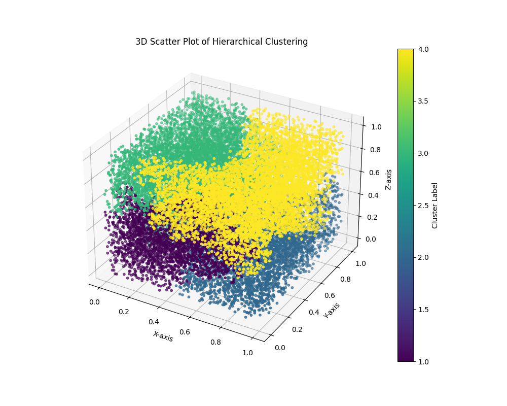
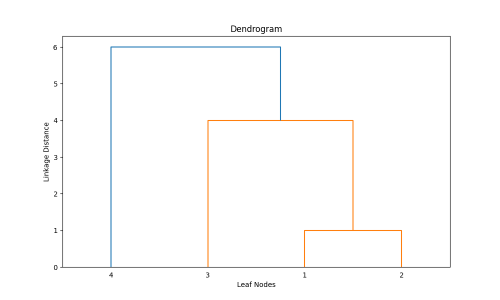
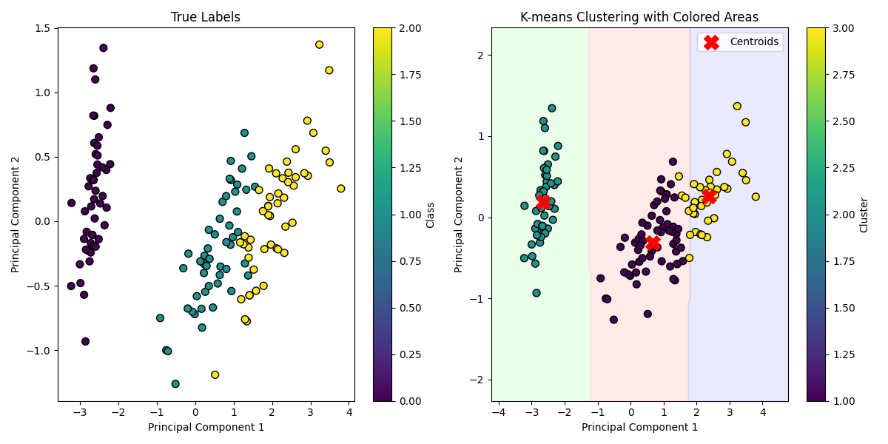

# Exploratory Data Analysis (EDA) Python Toolkit
The project is sponsored by Malmö Universitet developed by Eng. Marco Schivo and Eng. Alberto Biscalchin under the supervision of Associete Professor Yuanji Cheng and is released under the MIT License. It is open source and available for anyone to use and contribute to.

Internal course Code reference: MA661E
## Overview
This repository implements MATLAB-style functions in Python for various data analysis, clustering, dimensionality reduction, and graph algorithms. These functions leverage popular Python libraries such as `numpy`, `scipy`, `matplotlib`, `networkx`, and `scikit-learn`, while maintaining a familiar MATLAB-like syntax and behavior.

---

## Features

### 1. **Clustering and Dimensionality Reduction**
- **Hierarchical Clustering** (`linkage`, `cluster`):
  - MATLAB-style hierarchical clustering using `scipy.cluster.hierarchy`.
  - Supports `single`, `complete`, `average`, `ward`, and other linkage methods.
  - MATLAB-like `cluster` function for cutting hierarchical clusters based on distance or cluster count.

- **K-Means Clustering** (`kmeans`):
  - MATLAB-style K-Means implementation with support for:
    - Initialization methods: `k-means++`, random, or user-specified.
    - Metrics: `sqeuclidean` distance.
    - Number of replicates and maximum iterations.
  - Outputs cluster assignments, centroids, and within-cluster sum of distances.

- **PCA and SVD**:
  - `PCA`: Computes Principal Components and visualizes scree plots and scatter matrices.
  - `SVD`: Performs Singular Value Decomposition with visualization of singular values.

- **Non-Negative Matrix Factorization (NMF)**:
  - Reduces data dimensionality while ensuring non-negativity constraints.

- **Factor Analysis (FA)**:
  - Estimates latent factors using sklearn's `FactorAnalysis`.

- **Linear Discriminant Analysis (LDA)**:
  - Reduces dimensionality while maximizing class separability.

- **Random Projection**:
  - Performs Gaussian Random Projection to reduce dimensionality.

---

### 2. **Graph Algorithms**
- **Minimum Spanning Tree (MST)** (`minspantree`):
  - MATLAB-style wrapper using `networkx`.
  - Supports both Prim's (`dense`) and Kruskal's (`sparse`) algorithms.
  - Option to extract a spanning tree for a specific connected component or spanning forest.

---

### 3. **Intrinsic Dimensionality Estimation**
- **Packing Numbers**:
  - Computes intrinsic dimensionality using packing arguments.

- **Maximum Likelihood Estimation (MLE)**:
  - Estimates intrinsic dimensionality using a k-Nearest Neighbor approach.

- **Correlation Dimension**:
  - Estimates intrinsic dimensionality via correlation methods.

- **Pettis Method**:
  - Computes intrinsic dimensionality using Pettis et al.'s algorithm.

---

### 4. **Normalization**
- **Standardization (`with_std_dev`)**:
  - Standardizes data with zero-mean and unit variance.
  
- **Min-Max Normalization (`min_max_norm`)**:
  - Rescales data to a range between 0 and 1.

- **Sphering (`sphering`)**:
  - Whitens data, decorrelating variables and setting variance to 1.


---
# Examples
!IMPORTANT: The examples are not finished yet, they are just a draft of what we are going to implement.
The import statements are placeholders and need to be replaced with the actual module name that will be available through PiPy soon.
## Clustering
### **`Linkage` Function**

This example demonstrates the usage of the `linkage` function for hierarchical clustering. The `linkage` function builds a hierarchical cluster tree (also known as a dendrogram) using various linkage methods. We show two use cases: clustering a large dataset into groups and visualizing the hierarchy using a dendrogram.


#### Python Code:
```python
import numpy as np
import matplotlib.pyplot as plt
from pyEDAkit.clustering import linkage, cluster
from scipy.cluster.hierarchy import dendrogram
from scipy.spatial.distance import squareform
from mpl_toolkits.mplot3d import Axes3D

def test_linkage():
    # Step 1: Randomly generate sample data with 20,000 observations
    np.random.seed(0)  # For reproducibility
    X = np.random.rand(20000, 3)

    # Step 2: Create a hierarchical cluster tree using the ward linkage method
    Z = linkage(X, method='ward')

    # Step 3: Cluster the data into a maximum of four groups
    max_clusters = 4
    cluster_labels = cluster(Z, max_clusters, criterion='maxclust')

    # Step 4: Plot the result in 3D
    fig = plt.figure(figsize=(10, 8))
    ax = fig.add_subplot(111, projection='3d')

    scatter = ax.scatter(X[:, 0], X[:, 1], X[:, 2], c=cluster_labels, cmap='viridis', s=10)
    ax.set_xlabel('X-axis')
    ax.set_ylabel('Y-axis')
    ax.set_zlabel('Z-axis')

    plt.title('3D Scatter Plot of Hierarchical Clustering')
    plt.colorbar(scatter, ax=ax, label='Cluster Label')
    plt.show()

    # Step 5: Define the dissimilarity matrix
    X = np.array([
        [0, 1, 2, 3],
        [1, 0, 4, 5],
        [2, 4, 0, 6],
        [3, 5, 6, 0]
    ])

    # Step 6: Convert the dissimilarity matrix to vector form using squareform
    y = squareform(X)

    # Step 7: Create a hierarchical cluster tree using the 'complete' method
    Z = linkage(y, method='complete')

    # Step 8: Print the resulting linkage matrix
    print("Linkage matrix (Z):")
    print(Z)

    # Step 9: Plot the dendrogram
    plt.figure(figsize=(10, 6))
    dendrogram(
        Z,
        labels=[1, 2, 3, 4],  # Use MATLAB-style indices for the leaf nodes
        leaf_font_size=10      # Adjust font size for clarity
    )
    plt.title('Dendrogram')
    plt.xlabel('Leaf Nodes')
    plt.ylabel('Linkage Distance')
    plt.show()

test_linkage()
```

### Visualizations

#### **3D Scatter Plot of Hierarchical Clustering**
This plot visualizes the clusters formed by hierarchical clustering on a randomly generated dataset of 20,000 observations. The data points are colored by their cluster labels (maximum of 4 clusters).



---

#### **Dendrogram**
The dendrogram represents the hierarchical clustering of a small dataset, built from a dissimilarity matrix. The `complete` linkage method is used to compute the hierarchical structure, and the result is visualized as a dendrogram.



### **`Cluster` Function**

The `cluster` function is a MATLAB-style wrapper for SciPy's `fcluster` function, allowing flexible and intuitive hierarchical clustering. This example demonstrates its usage with various clustering criteria, such as distance thresholds, inconsistent measures, and a fixed number of clusters. Additionally, it supports multiple cutoffs to produce a matrix of cluster assignments.

---

#### Example:

```python
import numpy as np
from pyEDAkit.clustering import cluster, linkage 

def test_cluster():
    # Generate sample data
    X = np.random.rand(10, 3)

    # Compute linkage matrix
    Z = linkage(X, method='ward')

    # 1) Cut off by distance = 0.7
    T_distance = cluster(Z, 'Cutoff', 0.7, 'Criterion', 'distance')

    # 2) Cut off by inconsistent measure
    T_inconsist = cluster(Z, 'Cutoff', 1.5)

    # 3) Force a maximum of 3 clusters
    T_maxclust = cluster(Z, 'MaxClust', 3)

    # 4) Multiple cutoffs -> T is an m-by-l matrix
    T_multi = cluster(Z, 'Cutoff', [0.7, 1.0, 1.5], 'Criterion', 'distance')
    print(T_multi.shape)  # (10, 3)

test_cluster()
```

---

#### Output:

This example showcases the flexibility of the `cluster` function. Below is the output from the final step, where multiple cutoffs are used:

```bash
(10, 3)
```

---

### Key Points:

1. **Cut off by Distance**: Creates clusters by specifying a distance threshold. For example:
   ```python
   T_distance = cluster(Z, 'Cutoff', 0.7, 'Criterion', 'distance')
   ```

2. **Cut off by Inconsistent Measure**: Uses the default 'inconsistent' criterion for clustering:
   ```python
   T_inconsist = cluster(Z, 'Cutoff', 1.5)
   ```

3. **Force a Maximum Number of Clusters**: Ensures the data is divided into a fixed number of clusters:
   ```python
   T_maxclust = cluster(Z, 'MaxClust', 3)
   ```

4. **Multiple Cutoffs**: Produces a matrix where each column corresponds to cluster assignments for a specific cutoff:
   ```python
   T_multi = cluster(Z, 'Cutoff', [0.7, 1.0, 1.5], 'Criterion', 'distance')
   ```

The flexibility of `cluster` makes it an ideal choice for hierarchical clustering tasks requiring MATLAB-like functionality in Python.

---

### **`K-means` Clustering**

The `kmeans` function, imported from the `pyEDAkit.clustering` module, provides a MATLAB-style implementation of the K-means algorithm, allowing intuitive and flexible clustering with support for optional parameters such as the number of replicates and maximum iterations.

---

#### Example:

```python
import numpy as np
import pandas as pd
from pyEDAkit.clustering import kmeans
from sklearn.decomposition import PCA
import matplotlib.pyplot as plt
from matplotlib.colors import ListedColormap
from sklearn.metrics import accuracy_score

def test_kmeans():
    # Sample data
    X = np.array([[1, 2], [1, 4], [1, 0],
                  [10, 2], [10, 4], [10, 0],
                  [5, 2], [6, 3], [7, 4]])

    # 1) Basic call
    idx, C, sumd, D = kmeans(X, 2)  # 2 clusters

    print("Cluster labels (idx):\n", idx)
    print("Centroids (C):\n", C)
    print("Within-cluster sums (sumd):\n", sumd)
    print("Distances to centroids (D):\n", D)

    # 2) With optional name-value arguments, e.g., 'Replicates'
    idx2, C2, sumd2, D2 = kmeans(X, 3, 'Replicates', 5, 'MaxIter', 200, 'Display', 'iter')

    # Step 1: Load the Iris dataset
    iris_path = "../datasets/iris_dataset.csv"
    iris_data = pd.read_csv(iris_path)

    # Extract features and target labels
    X = iris_data.iloc[:, :-1].values  # First 4 columns (features)
    y_true = iris_data.iloc[:, -1].values  # Last column (true labels)

    # Map the target labels to numeric values
    label_mapping = {'Iris-setosa': 0, 'Iris-versicolor': 1, 'Iris-virginica': 2}
    y_numeric = np.array([label_mapping[label] for label in y_true])

    # Step 2: Apply K-means clustering
    k = 3  # Number of clusters (as Iris dataset has 3 classes)
    idx, C, sumd, D = kmeans(X, k, 'Distance', 'sqeuclidean', 'Replicates', 5, 'MaxIter', 300)

    # Step 3: Reduce dimensionality for visualization (using PCA)
    pca = PCA(n_components=2)  # Reduce to 2D
    X_pca = pca.fit_transform(X)

    # Transform centroids to PCA space
    C_pca = pca.transform(C)

    # Step 4: Visualize the clustering results with colored areas
    plt.figure(figsize=(12, 6))

    # Plot the true labels
    plt.subplot(1, 2, 1)
    scatter1 = plt.scatter(X_pca[:, 0], X_pca[:, 1], c=y_numeric, cmap='viridis', edgecolor='k', s=50)
    plt.title("True Labels")
    plt.xlabel("Principal Component 1")
    plt.ylabel("Principal Component 2")
    plt.colorbar(scatter1, label="Class")

    # Plot the K-means cluster assignments with colored areas
    plt.subplot(1, 2, 2)

    # Create a grid to color the background
    x_min, x_max = X_pca[:, 0].min() - 1, X_pca[:, 0].max() + 1
    y_min, y_max = X_pca[:, 1].min() - 1, X_pca[:, 1].max() + 1
    xx, yy = np.meshgrid(np.arange(x_min, x_max, 0.05),
                         np.arange(y_min, y_max, 0.05))

    # Predict the cluster for each point in the grid
    grid_points = np.c_[xx.ravel(), yy.ravel()]
    Z = kmeans(pca.inverse_transform(grid_points), k, 'Distance', 'sqeuclidean')[0]
    Z = Z.reshape(xx.shape)

    # Plot the filled contour for the clusters
    cmap = ListedColormap(['#FFCCCC', '#CCFFCC', '#CCCCFF'])
    plt.contourf(xx, yy, Z, cmap=cmap, alpha=0.4)

    # Scatter the points
    scatter2 = plt.scatter(X_pca[:, 0], X_pca[:, 1], c=idx, cmap='viridis', edgecolor='k', s=50)
    plt.scatter(C_pca[:, 0], C_pca[:, 1], c='red', s=200, marker='X', label="Centroids")  # Mark centroids
    plt.title("K-means Clustering with Colored Areas")
    plt.xlabel("Principal Component 1")
    plt.ylabel("Principal Component 2")
    plt.legend()
    plt.colorbar(scatter2, label="Cluster")

    plt.tight_layout()
    plt.show()

    # Step 5: Calculate and print accuracy
    # Map clusters to the closest true labels to calculate accuracy
    from scipy.stats import mode

    # Remap clusters to best match true labels
    remapped_idx = np.zeros_like(idx)
    for cluster in range(1, k + 1):  # Clusters are 1-based
        mask = (idx == cluster)
        remapped_idx[mask] = mode(y_numeric[mask])[0]

    # Calculate accuracy
    accuracy = accuracy_score(y_numeric, remapped_idx)
    print(f"Clustering Accuracy: {accuracy:.2f}")

    # Print results
    print("Cluster assignments (idx):")
    print(idx)
    print("\nCentroids (C):")
    print(C)
    print("\nWithin-cluster sum of distances (sumd):")
    print(sumd)

test_kmeans()
```
---
#### Centroids displacement plot

---

#### Bash Output:

```bash
Cluster labels (idx):
 [2. 2. 2. 1. 1. 1. 1. 1. 1.]
Centroids (C):
 [[8.  2.5]
 [1.  2. ]]
Within-cluster sums (sumd):
 [37.5  8. ]
Distances to centroids (D):
 [[4.92500000e+01 7.88860905e-31]
 [5.12500000e+01 4.00000000e+00]
 [5.52500000e+01 4.00000000e+00]
 [4.25000000e+00 8.10000000e+01]
 [6.25000000e+00 8.50000000e+01]
 [1.02500000e+01 8.50000000e+01]
 [9.25000000e+00 1.60000000e+01]
 [4.25000000e+00 2.60000000e+01]
 [3.25000000e+00 4.00000000e+01]]
Initialization complete
Iteration 0, inertia 38.0.
Iteration 1, inertia 20.0.
Converged at iteration 1: strict convergence.
Initialization complete
Iteration 0, inertia 38.0.
Iteration 1, inertia 20.0.
Converged at iteration 1: strict convergence.
Initialization complete
Iteration 0, inertia 54.0.
Iteration 1, inertia 31.333333333333336.
Converged at iteration 1: strict convergence.
Initialization complete
Iteration 0, inertia 31.0.
Iteration 1, inertia 26.1875.
Iteration 2, inertia 20.0.
Converged at iteration 2: strict convergence.
Initialization complete
Iteration 0, inertia 26.0.
Iteration 1, inertia 20.0.
Converged at iteration 1: strict convergence.
Clustering Accuracy: 0.89
Cluster assignments (idx):
[1. 1. 1. 1. 1. 1. 1. 1. 1. 1. 1. 1. 1. 1. 1. 1. 1. 1. 1. 1. 1. 1. 1. 1.
 1. 1. 1. 1. 1. 1. 1. 1. 1. 1. 1. 1. 1. 1. 1. 1. 1. 1. 1. 1. 1. 1. 1. 1.
 1. 1. 3. 3. 2. 3. 3. 3. 3. 3. 3. 3. 3. 3. 3. 3. 3. 3. 3. 3. 3. 3. 3. 3.
 3. 3. 3. 3. 3. 2. 3. 3. 3. 3. 3. 3. 3. 3. 3. 3. 3. 3. 3. 3. 3. 3. 3. 3.
 3. 3. 3. 3. 2. 3. 2. 2. 2. 2. 3. 2. 2. 2. 2. 2. 2. 3. 3. 2. 2. 2. 2. 3.
 2. 3. 2. 3. 2. 2. 3. 3. 2. 2. 2. 2. 2. 3. 2. 2. 2. 2. 3. 2. 2. 2. 3. 2.
 2. 2. 3. 2. 2. 3.]

Centroids (C):
[[5.006      3.418      1.464      0.244     ]
 [6.85       3.07368421 5.74210526 2.07105263]
 [5.9016129  2.7483871  4.39354839 1.43387097]]

Within-cluster sum of distances (sumd):
[15.2404     23.87947368 39.82096774]

Process finished with exit code 0
```

---

#### Key Points:

1. **Basic Clustering**:
   - Cluster assignment, centroids, within-cluster sum of distances, and point-to-centroid distances are calculated.
   
2. **Iris Dataset Example**:
   - Used the Iris dataset to cluster the data and compare with true labels for accuracy.
   
3. **Visualization**:
   - PCA reduces the dimensionality for 2D visualization.
   - Colored areas represent cluster boundaries, and centroids are marked with red `X`. 

4. **Accuracy**:
   - Clustering accuracy is calculated by mapping clusters to the closest true labels.

---

### **`minspantree` - Minimum Spanning Tree**

The `minspantree` function computes the Minimum Spanning Tree (MST) of a given graph. It supports both Prim's and Kruskal's algorithms and can return the MST for a specific component (`Type='tree'`) or the entire graph (`Type='forest'`).

---

#### Example:

```python
import networkx as nx
import matplotlib.pyplot as plt
from pyEDAkit.clustering import minspantree

def test_minspantree():
    # Create a graph with weighted edges
    G = nx.Graph()
    G.add_weighted_edges_from([
        (1, 2, 2.0),
        (2, 3, 1.5),
        (2, 4, 3.0),
        (1, 5, 4.0),
        (3, 5, 2.5),
        (4, 5, 1.0),
        (5, 6, 2.0)
    ])

    # Visualize the original graph
    plt.figure(figsize=(12, 6))
    plt.subplot(1, 3, 1)
    pos = nx.spring_layout(G, seed=42)  # For consistent layout
    nx.draw(G, pos, with_labels=True, node_color='lightblue', edge_color='gray', node_size=1000, font_size=10)
    labels = nx.get_edge_attributes(G, 'weight')
    nx.draw_networkx_edge_labels(G, pos, edge_labels=labels)
    plt.title("Original Graph")

    # 1) Compute MST using Prim's algorithm (default method)
    T_prim, pred_prim = minspantree(G)  # Assuming minspantree implements Prim's by default

    # Visualize MST with Prim's algorithm
    plt.subplot(1, 3, 2)
    nx.draw(T_prim, pos, with_labels=True, node_color='lightgreen', edge_color='blue', node_size=1000, font_size=10)
    labels = nx.get_edge_attributes(T_prim, 'weight')
    nx.draw_networkx_edge_labels(T_prim, pos, edge_labels=labels)
    plt.title("MST (Prim's Algorithm)")

    # 2) Compute MST using Kruskal's algorithm (Method='sparse')
    T_kruskal, pred_kruskal = minspantree(G, 'Method', 'sparse', 'Root', 2, 'Type', 'forest')

    # Visualize MST with Kruskal's algorithm
    plt.subplot(1, 3, 3)
    nx.draw(T_kruskal, pos, with_labels=True, node_color='lightcoral', edge_color='purple', node_size=1000, font_size=10)
    labels = nx.get_edge_attributes(T_kruskal, 'weight')
    nx.draw_networkx_edge_labels(T_kruskal, pos, edge_labels=labels)
    plt.title("MST (Kruskal's Algorithm)")

    plt.tight_layout()
    plt.show()

    # Print details of the MSTs
    print("\n--- MST using Prim's Algorithm ---")
    print("Edges of T (Prim):", list(T_prim.edges(data=True)))
    print("Predecessors (Prim):", pred_prim)

    print("\n--- MST using Kruskal's Algorithm ---")
    print("Edges of T (Kruskal):", list(T_kruskal.edges(data=True)))
    print("Predecessors (Kruskal):", pred_kruskal)

test_minspantree()
```

---

#### Visualization

- **Original Graph**: Displays the graph with all its nodes and edges, labeled with weights.
- **MST (Prim's Algorithm)**: Highlights the MST computed using Prim's algorithm, rooted at node 1.
- **MST (Kruskal's Algorithm)**: Displays the MST computed using Kruskal's algorithm, including a spanning forest for all components.


---

#### Bash Output

```bash
--- MST using Prim's Algorithm ---
Edges of T (Prim): [(1, 2, {'weight': 2.0}), (2, 3, {'weight': 1.5}), (3, 5, {'weight': 2.5}), (4, 5, {'weight': 1.0}), (5, 6, {'weight': 2.0})]
Predecessors (Prim): {1: 0, 2: 1, 3: 2, 4: 5, 5: 3, 6: 5}

--- MST using Kruskal's Algorithm ---
Edges of T (Kruskal): [(1, 2, {'weight': 2.0}), (2, 3, {'weight': 1.5}), (3, 5, {'weight': 2.5}), (4, 5, {'weight': 1.0}), (5, 6, {'weight': 2.0})]
Predecessors (Kruskal): {1: 2, 2: 0, 3: 2, 4: 5, 5: 3, 6: 5}

Process finished with exit code 0
```

---

#### Key Points

1. **Prim's Algorithm**:
   - Grows the MST from a specific root node.
   - Produces a single tree for the connected component containing the root.

2. **Kruskal's Algorithm**:
   - Builds the MST by adding edges with the smallest weights.
   - Can generate a spanning forest if the graph is disconnected.

3. **Visualization**:
   - Easily compares the original graph with the MSTs generated by different algorithms.

4. **Customizability**:
   - Supports options like specifying the root node and generating a forest for disconnected graphs.


## Dependencies
This repository requires the following Python libraries:
- `numpy>=1.21.0`
- `scipy>=1.7.0`
- `matplotlib>=3.4.0`
- `seaborn>=0.11.0`
- `scikit-learn>=0.24.0`
- `networkx>=2.5`
- `pandas>=1.3.0`


---

## Contributing
Feel free to fork this repository, report issues, or contribute by adding new MATLAB-style functions or improving existing ones. 

---

## License
This project is licensed under the MIT License. See `LICENSE` for more details.

