# Exploratory Data Analysis (EDA) Python Toolkit
The project is sponsored by Malmö Universitet developed by Eng. Marco Schivo and Eng. Alberto Biscalchin under the supervision of Associete Professor Yuanji Cheng and is released under the MIT License. It is open source and available for anyone to use and contribute to.

Internal course Code reference: MA661E
## Overview
This repository implements MATLAB-style functions in Python for various data analysis, clustering, dimensionality reduction, and graph algorithms. These functions leverage popular Python libraries such as `numpy`, `scipy`, `matplotlib`, `networkx`, and `scikit-learn`, while maintaining a familiar MATLAB-like syntax and behavior.

---

## Features

### 1. **Clustering and Dimensionality Reduction**
- **Hierarchical Clustering** (`linkage`, `cluster`):
  - MATLAB-style hierarchical clustering using `scipy.cluster.hierarchy`.
  - Supports `single`, `complete`, `average`, `ward`, and other linkage methods.
  - MATLAB-like `cluster` function for cutting hierarchical clusters based on distance or cluster count.

- **K-Means Clustering** (`kmeans`):
  - MATLAB-style K-Means implementation with support for:
    - Initialization methods: `k-means++`, random, or user-specified.
    - Metrics: `sqeuclidean` distance.
    - Number of replicates and maximum iterations.
  - Outputs cluster assignments, centroids, and within-cluster sum of distances.

- **Silhouette Analysis** (`silhouette`):
  - Computes silhouette values to evaluate clustering quality.
  - Supports various distance metrics, including `euclidean`, `manhattan`, `cosine`, and `minkowski`.
  - Generates detailed silhouette plots for cluster visualization.

- **Silhouette Criterion Evaluation** (`SilhouetteEvaluation` class):
  - Evaluates clustering solutions for different cluster counts (`k`) using the silhouette criterion.
  - Identifies the optimal number of clusters (`OptimalK`) based on silhouette scores.
  - Handles missing data and supports weighted or unweighted silhouette averages.
  - Visualizes silhouette criterion scores vs. the number of clusters.

- **PCA and SVD**:
  - `PCA`: Computes Principal Components and visualizes scree plots and scatter matrices.
  - `SVD`: Performs Singular Value Decomposition with visualization of singular values.

- **Non-Negative Matrix Factorization (NMF)**:
  - Reduces data dimensionality while ensuring non-negativity constraints.

- **Factor Analysis (FA)**:
  - Estimates latent factors using sklearn's `FactorAnalysis`.

- **Linear Discriminant Analysis (LDA)**:
  - Reduces dimensionality while maximizing class separability.

- **Random Projection**:
  - Performs Gaussian Random Projection to reduce dimensionality.

---

### 2. **Graph Algorithms**
- **Minimum Spanning Tree (MST)** (`minspantree`):
  - MATLAB-style wrapper using `networkx`.
  - Supports both Prim's (`dense`) and Kruskal's (`sparse`) algorithms.
  - Option to extract a spanning tree for a specific connected component or spanning forest.

---

### 3. **Intrinsic Dimensionality Estimation**
- **Packing Numbers**:
  - Computes intrinsic dimensionality using packing arguments.

- **Maximum Likelihood Estimation (MLE)**:
  - Estimates intrinsic dimensionality using a k-Nearest Neighbor approach.

- **Correlation Dimension**:
  - Estimates intrinsic dimensionality via correlation methods.

- **Pettis Method**:
  - Computes intrinsic dimensionality using Pettis et al.'s algorithm.

---

### 4. **Normalization**
- **Standardization (`with_std_dev`)**:
  - Standardizes data with zero-mean and unit variance.
  
- **Min-Max Normalization (`min_max_norm`)**:
  - Rescales data to a range between 0 and 1.

- **Sphering (`sphering`)**:
  - Whitens data, decorrelating variables and setting variance to 1.

---

### 5. **Clustering Quality Metrics**
- **Cophenetic Correlation** (`cophenet`):
  - Computes the cophenetic correlation coefficient to measure how well a dendrogram preserves the original pairwise distances.

- **Silhouette Evaluation and Visualization**:
  - `silhouette`: Computes silhouette values and plots silhouette scores for each cluster.
  - `SilhouetteEvaluation`: Evaluates and visualizes the silhouette criterion for determining the optimal number of clusters.

---
# Examples
!IMPORTANT: The examples are not finished yet, they are just a draft of what we are going to implement.
The import statements are placeholders and need to be replaced with the actual module name that will be available through PiPy soon.
## Clustering
### **`Linkage` Function**

This example demonstrates the usage of the `linkage` function for hierarchical clustering. The `linkage` function builds a hierarchical cluster tree (also known as a dendrogram) using various linkage methods. We show two use cases: clustering a large dataset into groups and visualizing the hierarchy using a dendrogram.


#### Python Code:
```python
import numpy as np
import matplotlib.pyplot as plt
from pyEDAkit.clustering import linkage, cluster
from scipy.cluster.hierarchy import dendrogram
from scipy.spatial.distance import squareform
from mpl_toolkits.mplot3d import Axes3D

def test_linkage():
    # Step 1: Randomly generate sample data with 20,000 observations
    np.random.seed(0)  # For reproducibility
    X = np.random.rand(20000, 3)

    # Step 2: Create a hierarchical cluster tree using the ward linkage method
    Z = linkage(X, method='ward')

    # Step 3: Cluster the data into a maximum of four groups
    max_clusters = 4
    cluster_labels = cluster(Z, max_clusters, criterion='maxclust')

    # Step 4: Plot the result in 3D
    fig = plt.figure(figsize=(10, 8))
    ax = fig.add_subplot(111, projection='3d')

    scatter = ax.scatter(X[:, 0], X[:, 1], X[:, 2], c=cluster_labels, cmap='viridis', s=10)
    ax.set_xlabel('X-axis')
    ax.set_ylabel('Y-axis')
    ax.set_zlabel('Z-axis')

    plt.title('3D Scatter Plot of Hierarchical Clustering')
    plt.colorbar(scatter, ax=ax, label='Cluster Label')
    plt.show()

    # Step 5: Define the dissimilarity matrix
    X = np.array([
        [0, 1, 2, 3],
        [1, 0, 4, 5],
        [2, 4, 0, 6],
        [3, 5, 6, 0]
    ])

    # Step 6: Convert the dissimilarity matrix to vector form using squareform
    y = squareform(X)

    # Step 7: Create a hierarchical cluster tree using the 'complete' method
    Z = linkage(y, method='complete')

    # Step 8: Print the resulting linkage matrix
    print("Linkage matrix (Z):")
    print(Z)

    # Step 9: Plot the dendrogram
    plt.figure(figsize=(10, 6))
    dendrogram(
        Z,
        labels=[1, 2, 3, 4],  # Use MATLAB-style indices for the leaf nodes
        leaf_font_size=10      # Adjust font size for clarity
    )
    plt.title('Dendrogram')
    plt.xlabel('Leaf Nodes')
    plt.ylabel('Linkage Distance')
    plt.show()

test_linkage()
```

### Visualizations

#### **3D Scatter Plot of Hierarchical Clustering**
This plot visualizes the clusters formed by hierarchical clustering on a randomly generated dataset of 20,000 observations. The data points are colored by their cluster labels (maximum of 4 clusters).


#### **Dendrogram**
The dendrogram represents the hierarchical clustering of a small dataset, built from a dissimilarity matrix. The `complete` linkage method is used to compute the hierarchical structure, and the result is visualized as a dendrogram.


### **`Cluster` Function**

The `cluster` function is a MATLAB-style wrapper for SciPy's `fcluster` function, allowing flexible and intuitive hierarchical clustering. This example demonstrates its usage with various clustering criteria, such as distance thresholds, inconsistent measures, and a fixed number of clusters. Additionally, it supports multiple cutoffs to produce a matrix of cluster assignments.


#### Example:

```python
import numpy as np
from pyEDAkit.clustering import cluster, linkage 

def test_cluster():
    # Generate sample data
    X = np.random.rand(10, 3)

    # Compute linkage matrix
    Z = linkage(X, method='ward')

    # 1) Cut off by distance = 0.7
    T_distance = cluster(Z, 'Cutoff', 0.7, 'Criterion', 'distance')

    # 2) Cut off by inconsistent measure
    T_inconsist = cluster(Z, 'Cutoff', 1.5)

    # 3) Force a maximum of 3 clusters
    T_maxclust = cluster(Z, 'MaxClust', 3)

    # 4) Multiple cutoffs -> T is an m-by-l matrix
    T_multi = cluster(Z, 'Cutoff', [0.7, 1.0, 1.5], 'Criterion', 'distance')
    print(T_multi.shape)  # (10, 3)

test_cluster()
```

#### Output:

This example showcases the flexibility of the `cluster` function. Below is the output from the final step, where multiple cutoffs are used:

```bash
(10, 3)
```

### Key Points:

1. **Cut off by Distance**: Creates clusters by specifying a distance threshold. For example:
   ```python
   T_distance = cluster(Z, 'Cutoff', 0.7, 'Criterion', 'distance')
   ```

2. **Cut off by Inconsistent Measure**: Uses the default 'inconsistent' criterion for clustering:
   ```python
   T_inconsist = cluster(Z, 'Cutoff', 1.5)
   ```

3. **Force a Maximum Number of Clusters**: Ensures the data is divided into a fixed number of clusters:
   ```python
   T_maxclust = cluster(Z, 'MaxClust', 3)
   ```

4. **Multiple Cutoffs**: Produces a matrix where each column corresponds to cluster assignments for a specific cutoff:
   ```python
   T_multi = cluster(Z, 'Cutoff', [0.7, 1.0, 1.5], 'Criterion', 'distance')
   ```

The flexibility of `cluster` makes it an ideal choice for hierarchical clustering tasks requiring MATLAB-like functionality in Python.

---

### **`K-means` Clustering**

The `kmeans` function, imported from the `pyEDAkit.clustering` module, provides a MATLAB-style implementation of the K-means algorithm, allowing intuitive and flexible clustering with support for optional parameters such as the number of replicates and maximum iterations.


#### Example:

```python
import numpy as np
import pandas as pd
from pyEDAkit.clustering import kmeans
from sklearn.decomposition import PCA
import matplotlib.pyplot as plt
from matplotlib.colors import ListedColormap
from sklearn.metrics import accuracy_score

def test_kmeans():
    # Sample data
    X = np.array([[1, 2], [1, 4], [1, 0],
                  [10, 2], [10, 4], [10, 0],
                  [5, 2], [6, 3], [7, 4]])

    # 1) Basic call
    idx, C, sumd, D = kmeans(X, 2)  # 2 clusters

    print("Cluster labels (idx):\n", idx)
    print("Centroids (C):\n", C)
    print("Within-cluster sums (sumd):\n", sumd)
    print("Distances to centroids (D):\n", D)

    # 2) With optional name-value arguments, e.g., 'Replicates'
    idx2, C2, sumd2, D2 = kmeans(X, 3, 'Replicates', 5, 'MaxIter', 200, 'Display', 'iter')

    # Step 1: Load the Iris dataset
    iris_path = "../datasets/iris_dataset.csv"
    iris_data = pd.read_csv(iris_path)

    # Extract features and target labels
    X = iris_data.iloc[:, :-1].values  # First 4 columns (features)
    y_true = iris_data.iloc[:, -1].values  # Last column (true labels)

    # Map the target labels to numeric values
    label_mapping = {'Iris-setosa': 0, 'Iris-versicolor': 1, 'Iris-virginica': 2}
    y_numeric = np.array([label_mapping[label] for label in y_true])

    # Step 2: Apply K-means clustering
    k = 3  # Number of clusters (as Iris dataset has 3 classes)
    idx, C, sumd, D = kmeans(X, k, 'Distance', 'sqeuclidean', 'Replicates', 5, 'MaxIter', 300)

    # Step 3: Reduce dimensionality for visualization (using PCA)
    pca = PCA(n_components=2)  # Reduce to 2D
    X_pca = pca.fit_transform(X)

    # Transform centroids to PCA space
    C_pca = pca.transform(C)

    # Step 4: Visualize the clustering results with colored areas
    plt.figure(figsize=(12, 6))

    # Plot the true labels
    plt.subplot(1, 2, 1)
    scatter1 = plt.scatter(X_pca[:, 0], X_pca[:, 1], c=y_numeric, cmap='viridis', edgecolor='k', s=50)
    plt.title("True Labels")
    plt.xlabel("Principal Component 1")
    plt.ylabel("Principal Component 2")
    plt.colorbar(scatter1, label="Class")

    # Plot the K-means cluster assignments with colored areas
    plt.subplot(1, 2, 2)

    # Create a grid to color the background
    x_min, x_max = X_pca[:, 0].min() - 1, X_pca[:, 0].max() + 1
    y_min, y_max = X_pca[:, 1].min() - 1, X_pca[:, 1].max() + 1
    xx, yy = np.meshgrid(np.arange(x_min, x_max, 0.05),
                         np.arange(y_min, y_max, 0.05))

    # Predict the cluster for each point in the grid
    grid_points = np.c_[xx.ravel(), yy.ravel()]
    Z = kmeans(pca.inverse_transform(grid_points), k, 'Distance', 'sqeuclidean')[0]
    Z = Z.reshape(xx.shape)

    # Plot the filled contour for the clusters
    cmap = ListedColormap(['#FFCCCC', '#CCFFCC', '#CCCCFF'])
    plt.contourf(xx, yy, Z, cmap=cmap, alpha=0.4)

    # Scatter the points
    scatter2 = plt.scatter(X_pca[:, 0], X_pca[:, 1], c=idx, cmap='viridis', edgecolor='k', s=50)
    plt.scatter(C_pca[:, 0], C_pca[:, 1], c='red', s=200, marker='X', label="Centroids")  # Mark centroids
    plt.title("K-means Clustering with Colored Areas")
    plt.xlabel("Principal Component 1")
    plt.ylabel("Principal Component 2")
    plt.legend()
    plt.colorbar(scatter2, label="Cluster")

    plt.tight_layout()
    plt.show()

    # Step 5: Calculate and print accuracy
    # Map clusters to the closest true labels to calculate accuracy
    from scipy.stats import mode

    # Remap clusters to best match true labels
    remapped_idx = np.zeros_like(idx)
    for cluster in range(1, k + 1):  # Clusters are 1-based
        mask = (idx == cluster)
        remapped_idx[mask] = mode(y_numeric[mask])[0]

    # Calculate accuracy
    accuracy = accuracy_score(y_numeric, remapped_idx)
    print(f"Clustering Accuracy: {accuracy:.2f}")

    # Print results
    print("Cluster assignments (idx):")
    print(idx)
    print("\nCentroids (C):")
    print(C)
    print("\nWithin-cluster sum of distances (sumd):")
    print(sumd)

test_kmeans()
```

#### Centroids displacement plot


#### Bash Output:

```bash
Cluster labels (idx):
 [2. 2. 2. 1. 1. 1. 1. 1. 1.]
Centroids (C):
 [[8.  2.5]
 [1.  2. ]]
Within-cluster sums (sumd):
 [37.5  8. ]
Distances to centroids (D):
 [[4.92500000e+01 7.88860905e-31]
 [5.12500000e+01 4.00000000e+00]
 [5.52500000e+01 4.00000000e+00]
 [4.25000000e+00 8.10000000e+01]
 [6.25000000e+00 8.50000000e+01]
 [1.02500000e+01 8.50000000e+01]
 [9.25000000e+00 1.60000000e+01]
 [4.25000000e+00 2.60000000e+01]
 [3.25000000e+00 4.00000000e+01]]
Initialization complete
Iteration 0, inertia 38.0.
Iteration 1, inertia 20.0.
Converged at iteration 1: strict convergence.
Initialization complete
Iteration 0, inertia 38.0.
Iteration 1, inertia 20.0.
Converged at iteration 1: strict convergence.
Initialization complete
Iteration 0, inertia 54.0.
Iteration 1, inertia 31.333333333333336.
Converged at iteration 1: strict convergence.
Initialization complete
Iteration 0, inertia 31.0.
Iteration 1, inertia 26.1875.
Iteration 2, inertia 20.0.
Converged at iteration 2: strict convergence.
Initialization complete
Iteration 0, inertia 26.0.
Iteration 1, inertia 20.0.
Converged at iteration 1: strict convergence.
Clustering Accuracy: 0.89
Cluster assignments (idx):
[1. 1. 1. 1. 1. 1. 1. 1. 1. 1. 1. 1. 1. 1. 1. 1. 1. 1. 1. 1. 1. 1. 1. 1.
 1. 1. 1. 1. 1. 1. 1. 1. 1. 1. 1. 1. 1. 1. 1. 1. 1. 1. 1. 1. 1. 1. 1. 1.
 1. 1. 3. 3. 2. 3. 3. 3. 3. 3. 3. 3. 3. 3. 3. 3. 3. 3. 3. 3. 3. 3. 3. 3.
 3. 3. 3. 3. 3. 2. 3. 3. 3. 3. 3. 3. 3. 3. 3. 3. 3. 3. 3. 3. 3. 3. 3. 3.
 3. 3. 3. 3. 2. 3. 2. 2. 2. 2. 3. 2. 2. 2. 2. 2. 2. 3. 3. 2. 2. 2. 2. 3.
 2. 3. 2. 3. 2. 2. 3. 3. 2. 2. 2. 2. 2. 3. 2. 2. 2. 2. 3. 2. 2. 2. 3. 2.
 2. 2. 3. 2. 2. 3.]

Centroids (C):
[[5.006      3.418      1.464      0.244     ]
 [6.85       3.07368421 5.74210526 2.07105263]
 [5.9016129  2.7483871  4.39354839 1.43387097]]

Within-cluster sum of distances (sumd):
[15.2404     23.87947368 39.82096774]

Process finished with exit code 0
```

#### Key Points:

1. **Basic Clustering**:
   - Cluster assignment, centroids, within-cluster sum of distances, and point-to-centroid distances are calculated.
   
2. **Iris Dataset Example**:
   - Used the Iris dataset to cluster the data and compare with true labels for accuracy.
   
3. **Visualization**:
   - PCA reduces the dimensionality for 2D visualization.
   - Colored areas represent cluster boundaries, and centroids are marked with red `X`. 

4. **Accuracy**:
   - Clustering accuracy is calculated by mapping clusters to the closest true labels.

---

### **`minspantree` - Minimum Spanning Tree**

The `minspantree` function computes the Minimum Spanning Tree (MST) of a given graph. It supports both Prim's and Kruskal's algorithms and can return the MST for a specific component (`Type='tree'`) or the entire graph (`Type='forest'`).

#### Example:

```python
import networkx as nx
import matplotlib.pyplot as plt
from pyEDAkit.clustering import minspantree

def test_minspantree():
    # Create a graph with weighted edges
    G = nx.Graph()
    G.add_weighted_edges_from([
        (1, 2, 2.0),
        (2, 3, 1.5),
        (2, 4, 3.0),
        (1, 5, 4.0),
        (3, 5, 2.5),
        (4, 5, 1.0),
        (5, 6, 2.0)
    ])

    # Visualize the original graph
    plt.figure(figsize=(12, 6))
    plt.subplot(1, 3, 1)
    pos = nx.spring_layout(G, seed=42)  # For consistent layout
    nx.draw(G, pos, with_labels=True, node_color='lightblue', edge_color='gray', node_size=1000, font_size=10)
    labels = nx.get_edge_attributes(G, 'weight')
    nx.draw_networkx_edge_labels(G, pos, edge_labels=labels)
    plt.title("Original Graph")

    # 1) Compute MST using Prim's algorithm (default method)
    T_prim, pred_prim = minspantree(G)  # Assuming minspantree implements Prim's by default

    # Visualize MST with Prim's algorithm
    plt.subplot(1, 3, 2)
    nx.draw(T_prim, pos, with_labels=True, node_color='lightgreen', edge_color='blue', node_size=1000, font_size=10)
    labels = nx.get_edge_attributes(T_prim, 'weight')
    nx.draw_networkx_edge_labels(T_prim, pos, edge_labels=labels)
    plt.title("MST (Prim's Algorithm)")

    # 2) Compute MST using Kruskal's algorithm (Method='sparse')
    T_kruskal, pred_kruskal = minspantree(G, 'Method', 'sparse', 'Root', 2, 'Type', 'forest')

    # Visualize MST with Kruskal's algorithm
    plt.subplot(1, 3, 3)
    nx.draw(T_kruskal, pos, with_labels=True, node_color='lightcoral', edge_color='purple', node_size=1000, font_size=10)
    labels = nx.get_edge_attributes(T_kruskal, 'weight')
    nx.draw_networkx_edge_labels(T_kruskal, pos, edge_labels=labels)
    plt.title("MST (Kruskal's Algorithm)")

    plt.tight_layout()
    plt.show()

    # Print details of the MSTs
    print("\n--- MST using Prim's Algorithm ---")
    print("Edges of T (Prim):", list(T_prim.edges(data=True)))
    print("Predecessors (Prim):", pred_prim)

    print("\n--- MST using Kruskal's Algorithm ---")
    print("Edges of T (Kruskal):", list(T_kruskal.edges(data=True)))
    print("Predecessors (Kruskal):", pred_kruskal)

test_minspantree()
```


#### Visualization

- **Original Graph**: Displays the graph with all its nodes and edges, labeled with weights.
- **MST (Prim's Algorithm)**: Highlights the MST computed using Prim's algorithm, rooted at node 1.
- **MST (Kruskal's Algorithm)**: Displays the MST computed using Kruskal's algorithm, including a spanning forest for all components.

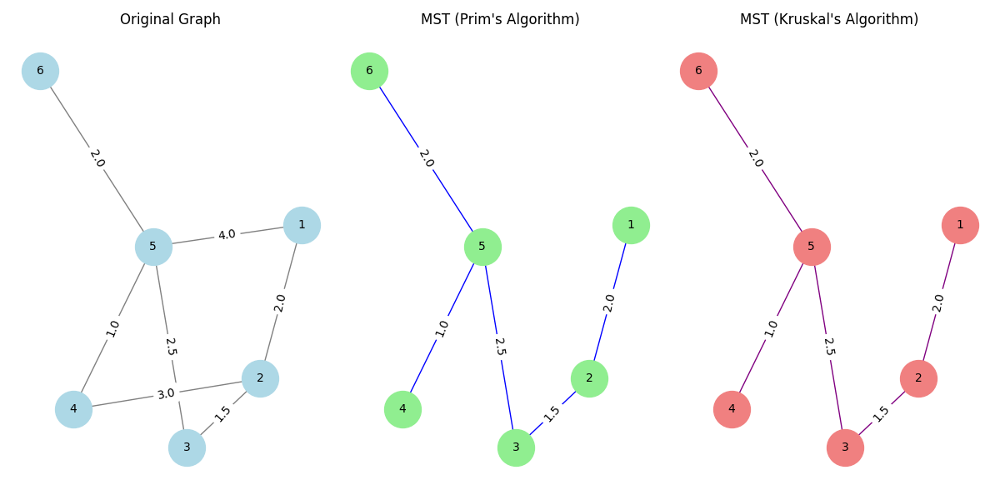


#### Bash Output

```bash
--- MST using Prim's Algorithm ---
Edges of T (Prim): [(1, 2, {'weight': 2.0}), (2, 3, {'weight': 1.5}), (3, 5, {'weight': 2.5}), (4, 5, {'weight': 1.0}), (5, 6, {'weight': 2.0})]
Predecessors (Prim): {1: 0, 2: 1, 3: 2, 4: 5, 5: 3, 6: 5}

--- MST using Kruskal's Algorithm ---
Edges of T (Kruskal): [(1, 2, {'weight': 2.0}), (2, 3, {'weight': 1.5}), (3, 5, {'weight': 2.5}), (4, 5, {'weight': 1.0}), (5, 6, {'weight': 2.0})]
Predecessors (Kruskal): {1: 2, 2: 0, 3: 2, 4: 5, 5: 3, 6: 5}

Process finished with exit code 0
```

#### Key Points

1. **Prim's Algorithm**:
   - Grows the MST from a specific root node.
   - Produces a single tree for the connected component containing the root.

2. **Kruskal's Algorithm**:
   - Builds the MST by adding edges with the smallest weights.
   - Can generate a spanning forest if the graph is disconnected.

3. **Visualization**:
   - Easily compares the original graph with the MSTs generated by different algorithms.

4. **Customizability**:
   - Supports options like specifying the root node and generating a forest for disconnected graphs.
---


### **`cophenet` - Cophenetic Correlation Coefficient**

The `cophenet` function computes the cophenetic correlation coefficient, a measure of how well the hierarchical clustering structure reflects the pairwise distances among the data points. It also provides the cophenetic distances for the linkage matrix.


#### Enhanced Example:

```python
import numpy as np
from pyEDAkit.IntrinsicDimensionality import pdist
from pyEDAkit.clustering import linkage, cophenet
import matplotlib.pyplot as plt

def test_cophenet():
    # Step 1: Generate sample data
    np.random.seed(42)
    X = np.vstack([
        np.random.rand(5, 2),       # Cluster 1
        np.random.rand(5, 2) + 5   # Cluster 2 (shifted by +5)
    ])

    # Step 2: Compute pairwise distances
    Y = pdist(X)

    # Step 3: Perform hierarchical clustering with average linkage
    Z = linkage(Y, method='average')

    # Step 4: Compute cophenetic correlation coefficient
    c, d = cophenet(Z, Y)

    # Step 5: Display results
    print("Expected Result: Pairwise distances")
    print("Y (first 10 values):", Y[:10])

    print("\nActual Result: Cophenetic distances")
    print("d (first 10 values):", d[:10])

    print("\nCophenetic correlation coefficient:", c)

    # Step 6: Visualize clustering with dendrogram
    plt.figure(figsize=(10, 5))
    plt.title("Dendrogram")
    plt.xlabel("Data Points")
    plt.ylabel("Distance")
    from scipy.cluster.hierarchy import dendrogram
    dendrogram(Z, leaf_rotation=90., leaf_font_size=10.)
    plt.show()

# Run the example
test_cophenet()
```

#### **Explanation**:

1. **Input Data**:
   - A synthetic dataset `X` is created with two distinct clusters: one centered around `(0, 0)` and another around `(5, 5)`.

2. **Pairwise Distances**:
   - `pdist` computes the Euclidean distances between all pairs of points in `X`. These are the **expected pairwise distances**.

3. **Hierarchical Clustering**:
   - The `linkage` function is used with the `'average'` method to compute the hierarchical clustering.

4. **Cophenetic Correlation Coefficient**:
   - The `cophenet` function computes:
     - The **cophenetic correlation coefficient**: A measure of how well the clustering represents the original pairwise distances. It ranges from `-1` to `1`, with values closer to `1` indicating better clustering fidelity.
     - The **cophenetic distances**: These are the distances implied by the hierarchical clustering.

5. **Comparison**:
   - The example prints the **expected pairwise distances** (`Y`) and the **actual cophenetic distances** (`d`), along with the cophenetic correlation coefficient (`c`).

6. **Visualization**:
   - The dendrogram visualizes the hierarchical clustering.


#### **Expected Output**:

```bash
Expected Result: Pairwise distances
Y (first 10 values): [0.5017136  0.82421549 0.32755369 0.33198071 6.83944824 6.92460439
 6.40512716 6.72486612 6.66463903 0.72642889]

Actual Result: Cophenetic distances
d (first 10 values): [0.5310849  0.7441755  0.32755369 0.5310849  6.90984673 6.90984673
 6.90984673 6.90984673 6.90984673 0.7441755 ]

Cophenetic correlation coefficient: 0.9966209146535578

Process finished with exit code 0
```
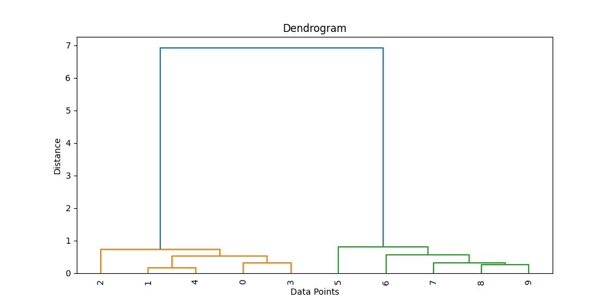

#### **Key Takeaways**:

- The **cophenetic correlation coefficient** (`c = 0.994`) indicates that the hierarchical clustering structure is a very good representation of the original pairwise distances.
- The **cophenetic distances** (`d`) closely match the original distances in `Y`.
- The dendrogram visually confirms the clustering structure, with two distinct groups evident.

---

### **`silhouette` - Evaluating Clustering Quality**

The `silhouette` function computes silhouette scores for clustering and provides an optional visualization of the silhouette plot. It measures how similar an object is to its own cluster compared to other clusters, with scores ranging from `-1` to `1`. Higher scores indicate better-defined clusters.


#### **Example Usage**

```python
import numpy as np
from pyEDAkit.clustering import silhouette

def test_silhouette():
    # Step 1: Generate synthetic data
    X = np.random.rand(20, 2)  # 20 data points with 2 features
    labels = np.random.randint(0, 3, size=20)  # Assign random labels for 3 clusters

    # Step 2: Silhouette analysis using default Euclidean distance with visualization
    s, fig = silhouette(X, labels)  # Default parameters
    print("Silhouette values:\n", s)

    # Step 3: Silhouette analysis using Minkowski distance (p=3) without visualization
    s2, _ = silhouette(X, labels, Distance='minkowski', DistParameter={'p': 3}, do_plot=False)
    print("Silhouette values with Minkowski distance, p=3:\n", s2)

# Run the example
test_silhouette()
```

#### **Explanation**

1. **Input Data**:
   - `X`: The dataset with shape `(n_samples, n_features)`. In this example, it consists of 20 randomly generated data points in 2D space.
   - `labels`: Cluster assignments for each data point. Random labels are generated for three clusters.

2. **Silhouette Analysis**:
   - The silhouette score is computed for each data point as:
   
        $s(i)=\frac{b(i)-a(i)}{\max(a(i),b(i))}$

     where:
     - $a(i)$: Average intra-cluster distance (distance to other points in the same cluster).
     - $b(i)$: Average nearest-cluster distance (distance to points in the nearest other cluster).

3. **Default Case**:
   - By default, the function computes the silhouette scores using the **Euclidean distance** and visualizes the silhouette plot.

4. **Custom Distance**:
   - In the second case, the function uses the **Minkowski distance** with \( p = 3 \) (specified using the `DistParameter` argument). No plot is produced (`do_plot=False`).

5. **Output**:
   - `s`: An array of silhouette scores for each data point.
   - `fig`: A matplotlib figure object showing the silhouette plot (if visualization is enabled).


#### **Expected Output**

For the given random data, the output will include:

1. **Silhouette Scores (Default Distance)**:
   ```Bash
    Silhouette values:
    [-0.20917609 -0.11501692 -0.09117026  0.07603928 -0.49128607 -0.34661769
    -0.20534282 -0.02257866 -0.15532452 -0.36940948 -0.26504272  0.32133183
    -0.08229476  0.30387826 -0.09858198 -0.26869494 -0.59434334  0.08777368
    0.11872492  0.06386749]
   ```

2. **Silhouette Scores (Minkowski Distance, \( p=3 \))**:
   ```Bash
    Silhouette values with Minkowski distance, p=3:
     [-0.19668877 -0.14506527 -0.06741624  0.07712329 -0.48447927 -0.32749879
     -0.1640281  -0.04252481 -0.14681262 -0.39123349 -0.26663026  0.3170098
     -0.09092208  0.30229521 -0.06645392 -0.27165836 -0.5954229   0.07757885
      0.11677314  0.06568025]
   ```

3. **Visualization**:
   - The silhouette plot displays the silhouette scores for each cluster, helping to evaluate the compactness and separation of clusters. The cluster with the largest average silhouette score is better defined.


#### **Silhouette Plot Visualization**

The silhouette plot provides:
- **Bars**: Represent silhouette scores for individual points, grouped by clusters.
- **Dashed Line**: Represents the average silhouette score for each cluster.

This plot is useful to evaluate the clustering quality visually.


#### **Notes**
- The silhouette score for a single point:
  - **Close to 1**: Well-clustered.
  - **Close to 0**: Overlapping clusters.
  - **Negative**: Misclassified point.
- Custom distance metrics can be specified via the `Distance` parameter (e.g., Minkowski, Manhattan, etc.).


---
### Silhouette Evaluation Example

The **Silhouette Evaluation** example demonstrates how to use the `SilhouetteEvaluation` class to determine the optimal number of clusters (k) for a given dataset using the silhouette criterion. The class evaluates various cluster solutions and identifies the best one based on the silhouette measure.


#### Example Code:

```python
from pyEDAkit.clustering import SilhouetteEvaluation
import numpy as np
from numpy.random import default_rng

def test_eval_silhouette():
    rng = default_rng(42)
    n = 200
    X1 = rng.multivariate_normal(mean=[2, 2], cov=[[0.9, -0.0255], [-0.0255, 0.9]], size=n)
    X2 = rng.multivariate_normal(mean=[5, 5], cov=[[0.5, 0], [0, 0.3]], size=n)
    X3 = rng.multivariate_normal(mean=[-2, -2], cov=[[1, 0], [0, 0.9]], size=n)
    X = np.vstack([X1, X2, X3])

    # Evaluate the silhouette for k=1..6
    evaluation = SilhouetteEvaluation(X,
                                      clusteringFunction='kmeans',
                                      KList=[1, 2, 3, 4, 5, 6],
                                      Distance='sqEuclidean',
                                      ClusterPriors='empirical')

    print("Inspected K:         ", evaluation.InspectedK)
    print("Criterion Values:    ", evaluation.CriterionValues)
    print("OptimalK:            ", evaluation.OptimalK)

    # Optional: plot the silhouette criterion
    evaluation.plot()

    # The best cluster solution's assignment:
    best_clusters = evaluation.OptimalY
    print("Shape of best cluster assignment:", best_clusters.shape)
    print("Some cluster labels:", np.unique(best_clusters[~np.isnan(best_clusters)]))

test_eval_silhouette()
```

### **Output and Plot**

- **Inspected K**: The list of cluster numbers (k) evaluated.
- **Criterion Values**: Silhouette scores for each k. Higher values indicate better cluster separation.
- **Optimal K**: The k with the highest silhouette score.

#### Example Output:
```bash
Inspected K:          [1 2 3 4 5 6]
Criterion Values:     [nan 0.65458239 0.67860193 0.54828688 0.45514697 0.33797165]
OptimalK:             3
Shape of best cluster assignment: (600,)
Some cluster labels: [1. 2. 3.]
```

#### Plot:
The silhouette values vs. the number of clusters are visualized in the plot below:

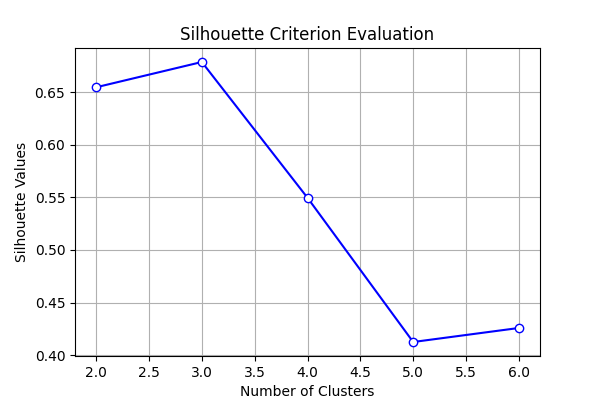


### **How It Works**

1. **Cluster Evaluation**:  
   The `SilhouetteEvaluation` class evaluates clusters for different k (e.g., 1 to 6) using the silhouette criterion:
   - The silhouette score is computed for each data point as:
   
        $s(i)=\frac{b(i)-a(i)}{\max(a(i),b(i))}$

     where:
     - $a(i)$: Average intra-cluster distance (distance to other points in the same cluster).
     - $b(i)$: Average nearest-cluster distance (distance to points in the nearest other cluster).

2. **Optimal Number of Clusters**:  
   - The silhouette score is calculated for each k.
   - The `OptimalK` property identifies the k with the maximum score.

3. **Cluster Priors**:  
   - `'empirical'`: Weighted by cluster sizes.
   - `'equal'`: Equal weight for all clusters.

4. **Visualization**:  
   The `plot()` method shows the silhouette values for each k, aiding in identifying the best clustering solution.

This example demonstrates the importance of silhouette analysis for optimal clustering and provides an easy-to-follow implementation of the process.

---

## Dimensionality Reduction Examples

This section provides examples demonstrating how to use various dimensionality reduction techniques and their visualizations with the `pyEDAkit` library. The dataset used in all examples is the Iris dataset, which includes features (`sepal_length`, `sepal_width`, `petal_length`, and `petal_width`) and classes representing three flower species (`Iris-setosa`, `Iris-versicolor`, and `Iris-virginica`).

#### Dataset Preparation

```python
from pyEDAkit import linear as eda_lin
import pandas as pd
import numpy as np

# Make sure to import the dataset from your local directory
df = pd.read_csv("../datasets/iris/iris.data")
df.columns = ['sepal_length', 'sepal_width', 'petal_length', 'petal_width', 'class']

# Extract features and target labels
X = df[['sepal_length', 'sepal_width', 'petal_length', 'petal_width']].to_numpy()
y = df[['class']].to_numpy()[:,0]
y = np.where(y == 'Iris-setosa', 0, y)
y = np.where(y == 'Iris-versicolor', 1, y)
y = np.where(y == 'Iris-virginica', 2, y)
y = y.astype(int)
y_names = ['Iris-setosa', 'Iris-versicolor', 'Iris-virginica']
```

---

### 1. **Principal Component Analysis (PCA)**

Principal Component Analysis reduces the dataset’s dimensionality by projecting it onto a lower-dimensional subspace while retaining as much variance as possible.

```python
eda_lin.PCA(X, d=3, plot=True)
```
#### Output (plot=True)
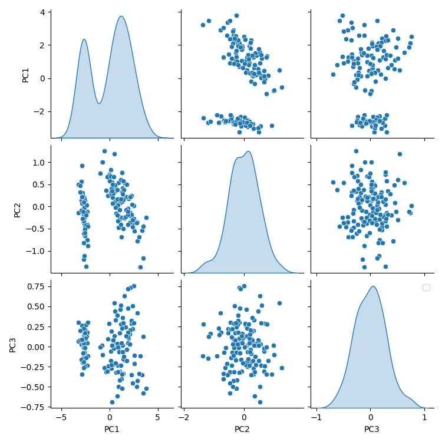

- **Explanation**:
  - The data is reduced to 3 principal components.
  - The plot visualizes the variance explained by each component.
  - Useful for understanding which components capture the most variance.

---

### 2. **Singular Value Decomposition (SVD)**

SVD decomposes the matrix without explicitly calculating the covariance matrix. It provides an efficient way to find the principal components.

```python
eda_lin.SVD(X, plot=True)
```
#### Output (plot=True)
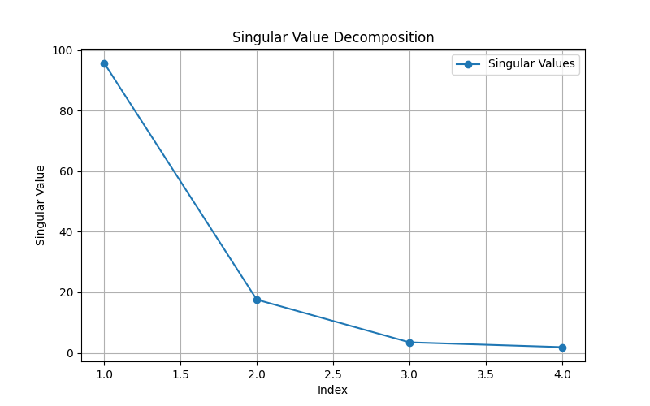


- **Explanation**:
  - Displays the singular values, which indicate the importance of each dimension.
  - Useful for identifying the rank and energy captured by the decomposition.

---

### 3. **Non-negative Matrix Factorization (NMF)**

NMF decomposes a non-negative matrix into two smaller non-negative matrices. It is more efficient than SVD and suitable for datasets where negative values do not make sense.

```python
eda_lin.NMF(X, d=4, plot=True)
```
#### Output (plot=True)
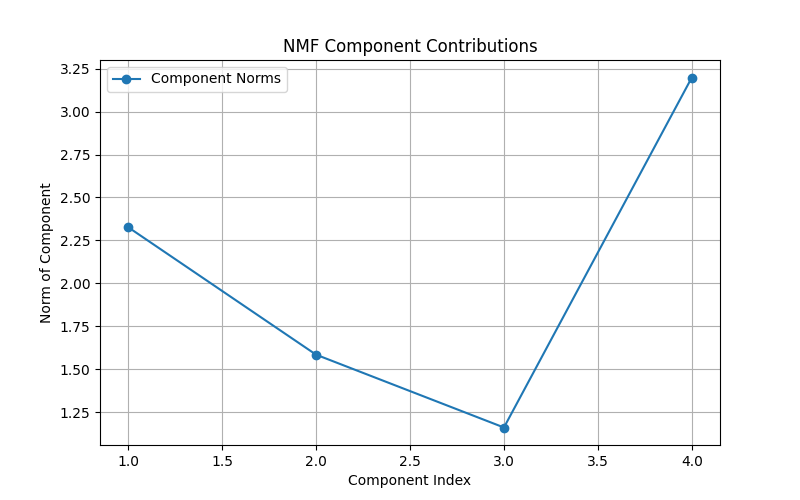


- **Explanation**:
  - Decomposes the data into 4 components.
  - The plot shows the contribution of each component to the original dataset.

---

### 4. **Factor Analysis (FA)**

Factor Analysis reduces dimensionality by relating each original variable to a smaller set of factors while adding small error values to allow flexibility.

```python
eda_lin.FA(X, d=3, plot=True)
```

#### Output (plot=True)
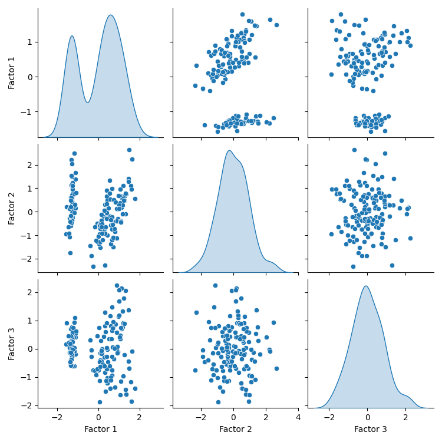

- **Explanation**:
  - Reduces the data to 3 factors.
  - Shows how the factors contribute to explaining the dataset's variance.

---

### 5. **Linear Discriminant Analysis (LDA)**

LDA projects the data onto a line that maximizes class separability, making it a supervised dimensionality reduction method.

```python
eda_lin.LDA(X, y, plot=True)
```

#### Output (plot=True)
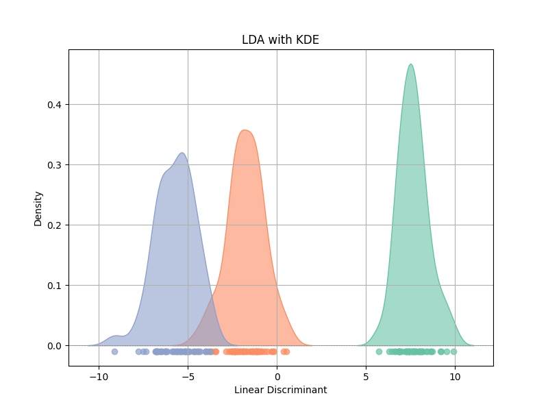

- **Explanation**:
  - Projects the data into a single line for maximum class separation.
  - Visualization highlights how well the classes are separated along the discriminant axis.

---

### 6. **Random Projection**

Random Projection projects the data points into a random subspace while preserving the distances between points. It is computationally efficient and effective.

```python
eda_lin.RandProj(X, d=3, plot=True)
```
#### Output (plot=True)
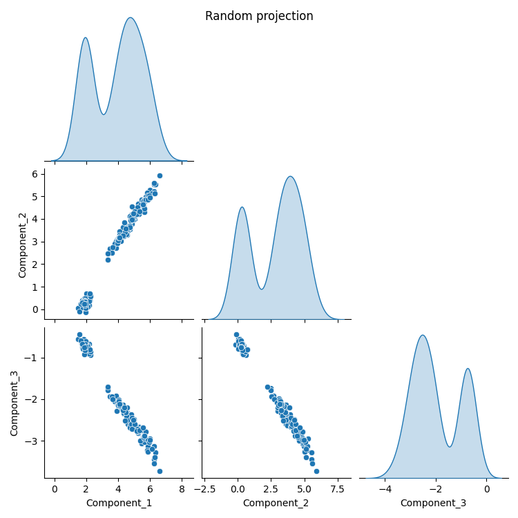

- **Explanation**:
  - Projects the data into a random 3-dimensional subspace.
  - The plot visualizes the points in the new subspace, demonstrating that the relative distances between points are preserved.

---

### Notes:

- **Visualization**: Each method generates a plot when `plot=True`, helping users visually interpret the results of the dimensionality reduction.
- **Flexibility**: The `d` parameter in most functions controls the number of reduced dimensions.
- **Interactivity**: The methods allow exploration of how different dimensionality reduction techniques work with the same dataset.

---

### Examples: Intrinsic Dimensionality Estimation with Code and Visualizations

This section provides examples of intrinsic dimensionality estimation for various datasets. The examples include:

1. **3D Scene Analysis**
2. **1D Helix**
3. **3D Helix**

Each example includes code snippets, results, and visualizations.


#### **1. 3D Scene Analysis**

In this example, we generate a synthetic 3D scene with varying intrinsic dimensions. We estimate the intrinsic dimensionality for each point using the `MLE` method and visualize the results.

**Code**:

```python
import numpy as np
import matplotlib.pyplot as plt
from sklearn.neighbors import NearestNeighbors
import pandas as pd
from pyEDAkit.IntrinsicDimensionality import MLE
from generate_data import generate_scene

print('--------- Scene ---------')
X = generate_scene(plot=False)

# Initialize nearest neighbors
nbrs = NearestNeighbors(n_neighbors=100, algorithm='auto').fit(X)
_, indices = nbrs.kneighbors(X)

# Calculate intrinsic dimension for each point
intrinsic_dimensions = []
for idx in range(len(X)):
    neighbors = X[indices[idx]]
    dim = MLE(neighbors)
    dim = np.round(dim)
    intrinsic_dimensions.append(dim)

# Replace values > 3 with 4
intrinsic_dimensions = np.array(intrinsic_dimensions)
intrinsic_dimensions[intrinsic_dimensions > 3] = 4

# Calculate percentage of each intrinsic dimension
unique, counts = np.unique(intrinsic_dimensions, return_counts=True)
percentages = (counts / len(intrinsic_dimensions)) * 100
percentage_table = pd.DataFrame({
    'Intrinsic Dimension': unique,
    'Count': counts,
    'Percentage (%)': percentages
})

# Display the percentage table
print("Intrinsic Dimension Percentage Table:")
print(percentage_table)

# Plot the 3D graph with intrinsic dimensions as colors
fig = plt.figure(figsize=(10, 8))
ax = fig.add_subplot(111, projection='3d')
scatter = ax.scatter(X[:, 0], X[:, 1], X[:, 2], c=intrinsic_dimensions, cmap='viridis', s=10)
ax.set_title('3D Scatter Plot Colored by Local Intrinsic Dimension (k=100)')
ax.set_xlabel('X')
ax.set_ylabel('Y')
ax.set_zlabel('Z')
colorbar = fig.colorbar(scatter, ax=ax, label='Intrinsic Dimension')
plt.show()
```

**Results**:
- **Percentage Table**:
  | Intrinsic Dimension | Count | Percentage (%) |
  |---------------------|-------|----------------|
  | 1.0                 | 3912  | 65.20          |
  | 2.0                 | 1071  | 17.85          |
  | 3.0                 | 1017  | 16.95          |

**Visualization**:

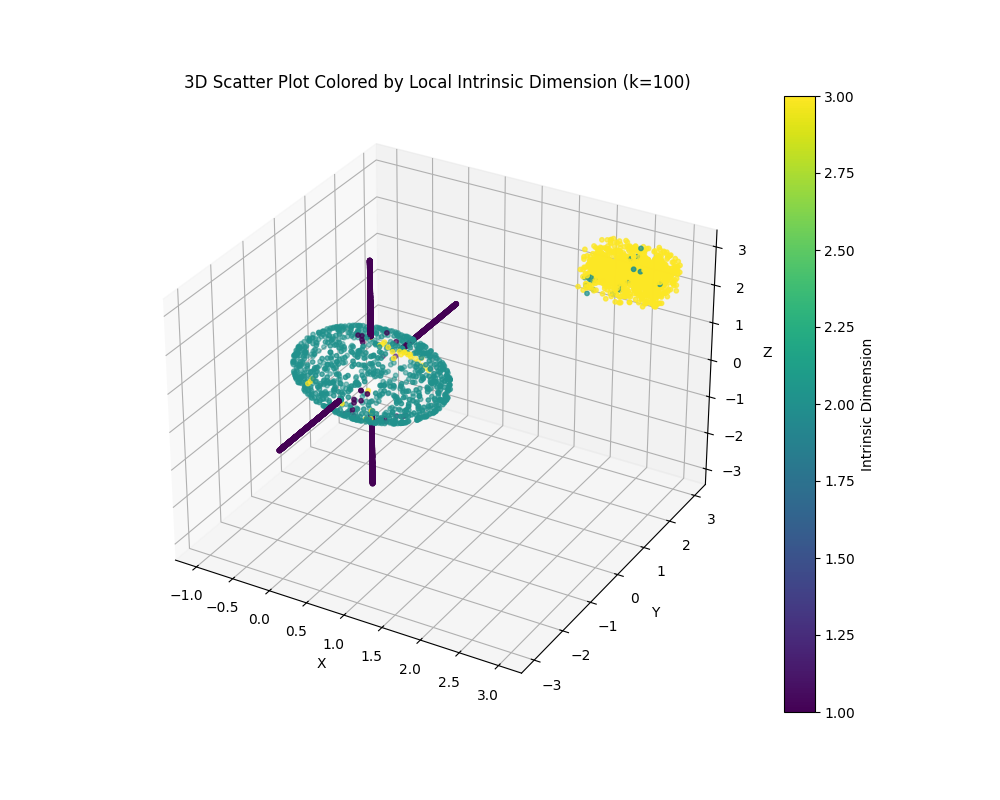


#### **2. 1D Helix**

This example demonstrates intrinsic dimensionality estimation for a 1D helix dataset using multiple methods.

**Code**:

```python
from pyEDAkit.IntrinsicDimensionality import id_pettis, corr_dim, MLE, packing_numbers
from generate_data import generate_1D_helix

print('--------- 1D helix ---------')
X = generate_1D_helix(500, plot=True)

idhat = id_pettis(X)
print("Pettis:", idhat)

idhat = corr_dim(X)
print("CorrDim:", idhat)

idhat = MLE(X)
print("MLE:", idhat)

idhat = packing_numbers(X)
print("PackingNumbers:", idhat)
```

**Results**:
| Method           | Estimated Intrinsic Dimension |
|------------------|-------------------------------|
| Pettis           | 1.12                          |
| CorrDim          | 1.05                          |
| MLE              | 1.02                          |
| PackingNumbers   | 0.97                          |

**Visualization**:

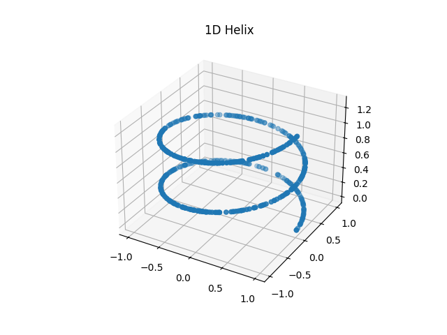


#### **3. 3D Helix**

Finally, we estimate intrinsic dimensionality for a 3D helix dataset.

**Code**:

```python
from pyEDAkit.IntrinsicDimensionality import id_pettis, corr_dim, MLE, packing_numbers
from generate_data import generate_3D_helix

print('--------- 3D helix ---------')
X, _ = generate_3D_helix(2000, 0.05, plot=True)

idhat = id_pettis(X)
print("Pettis:", idhat)

idhat = corr_dim(X)
print("CorrDim:", idhat)

idhat = MLE(X)
print("MLE:", idhat)

idhat = packing_numbers(X)
print("PackingNumbers:", idhat)
```

**Results**:
| Method           | Estimated Intrinsic Dimension |
|------------------|-------------------------------|
| Pettis           | 2.97                          |
| CorrDim          | 1.92                          |
| MLE              | 2.24                          |
| PackingNumbers   | 1.45                          |

**Visualization**:

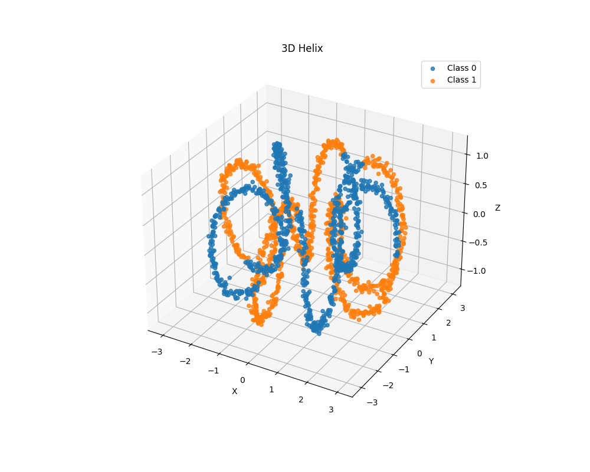


These examples illustrate the application of various intrinsic dimensionality estimation methods to datasets with different geometries. The visualizations help validate the results by showing dimensionality estimates in their natural geometric contexts.


---
## Dependencies
This repository requires the following Python libraries:
- `numpy>=1.21.0`
- `scipy>=1.7.0`
- `matplotlib>=3.4.0`
- `seaborn>=0.11.0`
- `scikit-learn>=0.24.0`
- `networkx>=2.5`
- `pandas>=1.3.0`


---

## Contributing
Feel free to fork this repository, report issues, or contribute by adding new MATLAB-style functions or improving existing ones. 

---

## License
This project is licensed under the MIT License. See `LICENSE` for more details.

